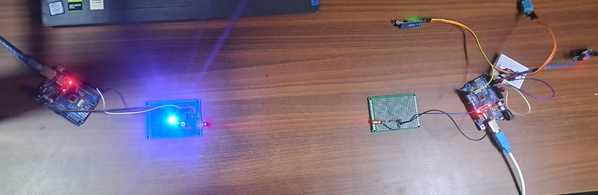
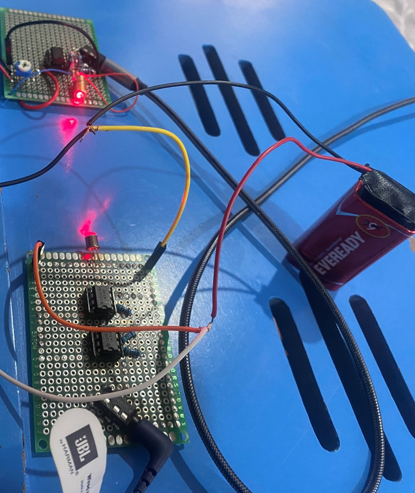
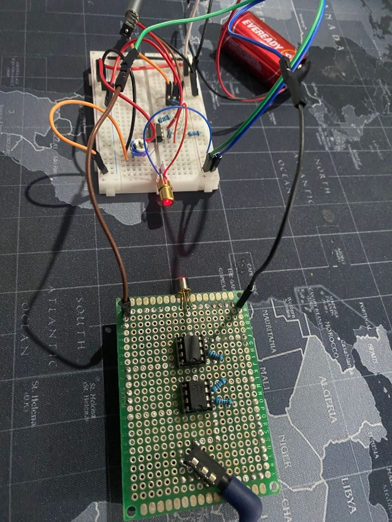

# Free-Space Optical Transceiver

A line-of-sight optical link that carries audio and live sensor data over a
laser beam, with no wire and no radio. Transmitter modulates a laser diode;
receiver recovers the signal through a photodiode front end and an op-amp
gain stage.

**Status:** Built on solder board and bench tested.
**Tools:** LTspice, Autodesk Eagle, Arduino, Falstad

## Specification

| Parameter | Value |
|---|---|
| Channel | Free-space optical, line of sight |
| Source | Red laser diode, two channels |
| Detector | BPW46 photodiode front end plus IR phototransistor |
| Receiver gain stage | LM358 dual op-amp |
| Payload | Analogue audio, and digital sensor data over serial |
| Supply | 9 V per side, battery powered |
| Alignment | Servo-mounted head on an adjustable clamp |

## What is in this repository

| Path | Contents |
|---|---|
| `simulation/transceiver.asc` | Transmitter and receiver chain, LTspice |
| `simulation/receiver-stage-draft.asc` | Earlier receiver stage |
| `simulation/transmitter-falstad.txt` | Transmitter netlist, Falstad format |
| `hardware/transceiver.sch` | Eagle schematic |
| `hardware/transceiver.brd` | Eagle board layout |
| `hardware/bom.csv` | Bill of materials as built |
| `firmware/transmitter.ino` | Sensor acquisition and transmit side |
| `firmware/receiver.ino` | Receive and decode side |
| `images/` | Photographs from a related build, see below |

## How it works

The link has two independent paths sharing the same optics.

**Audio path.** Line-level audio enters through a 3.5 mm jack, is buffered
and used to modulate laser intensity directly. At the far end the photodiode
current is converted to a voltage and amplified back up to line level into a
second 3.5 mm jack. This path is fully analogue, so there is no sample rate
and no codec, and the bandwidth limit is set by the detector and the amplifier
rather than by any digital stage.

**Data path.** The transmitter microcontroller reads a DHT11 for temperature
and humidity, a soil moisture probe, and an infrared sensor used to count
objects passing a point, then sends framed messages over serial into the same
optical channel. The receiver decodes them back to serial at the other end.
This is what demonstrates the link is carrying real information rather than
just a tone.

Two 10 kΩ potentiometers set transmit drive and receive gain, so the link can
be trimmed for distance and ambient light rather than being fixed at design
time. A servo on an adjustable clamp handles alignment, which matters because
a laser link has a very narrow acceptance angle and a few degrees of drift
breaks it.

## Simulation

`simulation/transceiver.asc` models the full chain: a 3.3 V, 100 Hz input
standing in for the modulating signal, an op-amp transmit stage, an
optocoupler standing in for the optical hop itself, and two receive gain
stages on a 9 V rail. Feedback and bias networks are 10 kΩ throughout with a
5.1 kΩ setting the final stage.

The simulation uses OP747 op-amps because that is what had a usable SPICE
model to hand. The board was built with LM358, which is what the bill of
materials lists. The two parts are pin compatible in this configuration and
the topology is unchanged, but the simulated slew rate and input offset are
not the ones on the bench, so the simulation shows the intended behaviour of
the circuit rather than the measured behaviour of the build.

The transmitter was first roughed out in Falstad before moving to LTspice;
that netlist is kept in `simulation/transmitter-falstad.txt`.

## Design notes

**Why a photodiode front end and not just a phototransistor.** A
phototransistor gives gain for free but is slow and its response varies
widely part to part. The BPW46 photodiode is fast and linear, at the cost of
producing a very small current that has to be amplified. Both are in the
build: the photodiode carries the signal path, the phototransistor is used
where speed does not matter.

**Why the receiver is two stages.** A single stage with enough gain to bring
photodiode current up to line level would sit close to the op-amp's
gain-bandwidth limit and would amplify its own offset along with the signal.
Splitting it lets the first stage do current-to-voltage conversion close to
the detector and the second stage set the output level.

**Ambient light is the real enemy.** Room lighting puts a large DC term and a
mains-frequency component on top of the signal. The gain trim exists so the
front end can be backed off far enough not to saturate under whatever
lighting the link is being demonstrated in.

## Bill of materials

See [`hardware/bom.csv`](hardware/bom.csv). Headline parts:

| Part | Component |
|---|---|
| LM358ANFS-ND | Dual op-amp, receiver gain stages |
| BPW46 | Photodiode, optical front end |
| LT9593-91-0125 | IR phototransistor |
| 2N3904 | NPN transistor |
| hs-244 | Servo motor, beam alignment |
| 3386F-103-ND | 10 kΩ potentiometers, drive and gain trim |

## Related build

The photographs below are **not** of the boards this schematic describes.
They are from a separate optical link built on the same transmitter and
receiver topology: laser diode source, photodiode front end, LM358 gain
stage, Arduino either side carrying sensor data. They are included because
they show that topology working, not as evidence for this design.

> TODO: replace this line with what the related build actually was and when.

Transmitter on the right with a DHT11 and an infrared sensor attached,
receiver on the left, beam crossing the gap between them into a second
Arduino.

Both ends on solder board. The op-amps sit in DIP sockets so they could be
swapped during bring-up, a trimmer sets gain, and each side runs from its
own 9 V battery so there is no shared ground between transmitter and
receiver. Audio in and out through the 3.5 mm jacks.

The transmitter kept on breadboard while the drive circuit was still
changing, laser diode at the edge pointing down at the receiver. The red
bloom is the beam scattering off the board surface, which is also how
alignment was judged by eye.

## Status and next steps

The link was built on solder board and demonstrated carrying both audio and
sensor telemetry.

Outstanding work:

1. Photographs of these boards. The images in this repository are from a
   related build, so the hardware this schematic describes is not yet shown
   anywhere.
2. Scope captures at the receiver output, so simulated and measured
   behaviour can be compared directly.
3. Record a measured range, data rate and audio bandwidth figure.

## Licence

MIT. See [LICENSE](LICENSE).
